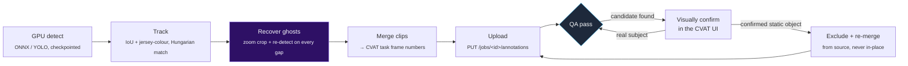

<div align="center">


### Point it at a video and a CVAT task. Get back tracked players, not empty gaps.

[](LICENSE)
[](https://github.com/cvat-ai/cvat)
[](#-install)
[](#-the-honest-part)

</div>

---

## The problem this exists to fix

You run an off-the-shelf detector on sports footage and it does fine — right
up until a ruck forms, a tackle happens, or two players cross paths. For a
few frames, your subject is gone. Most auto-tracking pipelines handle this
one of two ways: **drop the track** (now it's two different "people" before
and after the pile-up) or **freeze a box** on the last known position and
call it done (now it's confidently wrong for half a second).

FieldGhost does neither. When a track hits a gap, it makes an estimate —
call it a **ghost box** — and then it goes back and actually looks: crops in
tight on where the subject *should* be, reruns detection at a lower
threshold on just that crop, and only if it finds something that plausibly
matches does the ghost become real again. What's left unresolved stays
flagged as a ghost, so a human reviewer knows exactly which handful of
frames, out of thousands, actually need their eyes.

Then it uploads straight into your CVAT task via the REST API, and helps you
hunt down the other kind of ghost — the corner flag or touchline pole that
got mislabeled as a person — without ever deleting real annotations by
accident.

## What it actually does



Five stages, one video → one CVAT task:

1. **Detect** — GPU pass with an ONNX YOLO model, multi-scale tiling for
   small/distant subjects, checkpointed to disk every frame so a crash or a
   reboot costs you nothing.
2. **Track** — constant-velocity + IoU + jersey-colour association, stitched
   across occlusion gaps with the Hungarian algorithm.
3. **Recover** — the part that gives this its name. Every gap gets one more
   real shot at being found before it's allowed to stay a ghost.
4. **Merge & upload** — clip-local frame numbers → your CVAT task's global
   numbering, split at job boundaries, `PUT` straight to the API.
5. **QA** — a heuristic flags *candidates* for static-object false positives
   (never auto-deletes), you visually confirm in the CVAT UI, and only
   confirmed objects get excluded — from a fresh rebuild, not an in-place
   edit.

## 🚀 Install

FieldGhost ships as a **Claude Code skill** (works the same way for any
agent that reads `SKILL.md`-style instructions, Codex included).

```bash
git clone https://github.com/EminSgl/fieldghost.git
cp -r fieldghost/skill ~/.claude/skills/fieldghost
pip install -r ~/.claude/skills/fieldghost/requirements.txt
```

Then just talk to your agent:

> "Track the players in this rugby match and upload it to my CVAT task."

It'll ask you for what it needs (CVAT host, task/job ids, label id, your
clips, a detector model) — see [`skill/SKILL.md`](skill/SKILL.md) for the
full checklist it works from, or fill in
[`skill/config.example.yaml`](skill/config.example.yaml) yourself and hand
it over directly.

No Claude/Codex, just Python? All five stages are plain, dependency-light
scripts under `skill/scripts/` — run them by hand, same flags, same config
file. `SKILL.md` doubles as the operator's manual.

## The ghost, made visible

Every recovered box remembers what it used to be. Set a mutable attribute
in your config and every shape gets tagged `detected` or
`unresolved_detection_gap` — filter for the second one in the CVAT UI and
you get a punch list of exactly the handful of frames worth a human glance,
out of however many thousand your match had.

```yaml
ghost_attribute:
  spec_id: 26
  resolved_value: "detected"
  unresolved_value: "unresolved_detection_gap"
```

## The honest part

The QA pass includes a heuristic that flags *candidate* false positives —
static things like corner flags or touchline poles that get mislabeled as
people because, to a detector, a thin motionless object and a real subject
standing still for a few seconds look the same. We tested it on real match
footage. About a third of its "confident" candidates were actually real
players standing around during a stoppage.

So it doesn't auto-delete. It prints a list, a sample frame for each, and
tells you exactly where to look. You (or your agent, with a browser)
confirm each one visually before anything gets removed — and removal always
rebuilds from the untouched source tracks, never edits a file in place. Get
a box wrong, fix it, rerun; nothing was ever at risk.

We think a pipeline that's upfront about where it can be wrong is more
useful than one that quietly can't be — see
[`skill/SKILL.md`](skill/SKILL.md#5-qa-find-and-remove-false-positive-ghost-object-labels)
for the full writeup.

## Gotchas this skill already knows about

So your agent doesn't have to rediscover them:

- CVAT is usually behind **Cloudflare** — no User-Agent, no response.
  Handled in `scripts/cvat_client.py`.
- CVAT tokens **go stale** between sessions. Upload raises a clear
  `TokenExpired` instead of a confusing 403.
- Mutable attributes belong on the **shape**, not the track, or CVAT
  silently drops them.
- `PUT /annotations` is a **full replace**, not a merge — which is exactly
  why every stage here is rebuild-from-source, not edit-in-place.
- Long GPU runs get **checkpointed**, not restarted, after a crash or reboot.

Full detail in [`skill/references/cvat-api-notes.md`](skill/references/cvat-api-notes.md).

## Requirements

- [CVAT](https://github.com/cvat-ai/cvat) task already created, video
  uploaded, split into jobs
- A YOLO-family ONNX model with NMS baked in (e.g. a `yolov7-nms-*.onnx`
  export)
- Python 3.10+, ideally with `onnxruntime-gpu` + a CUDA GPU (CPU works, just
  slower)

See [`skill/requirements.txt`](skill/requirements.txt).

## Contributing

Issues and PRs welcome — especially other detector backends, other
tracking association strategies, or a smarter static-object classifier than
"ask a human to look." If you use FieldGhost on a sport this wasn't tested
on, we'd love to hear how it went.

## License

[MIT](LICENSE)
